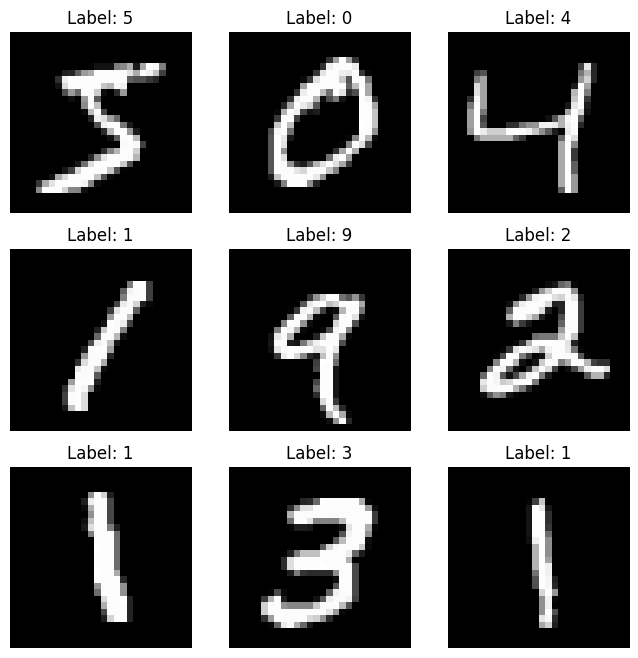
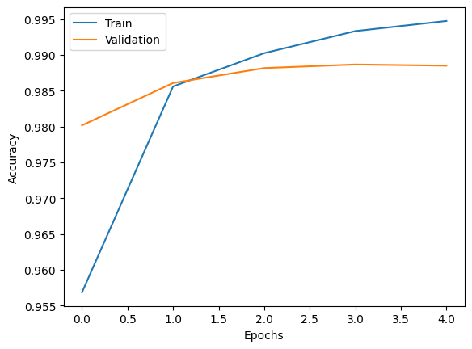
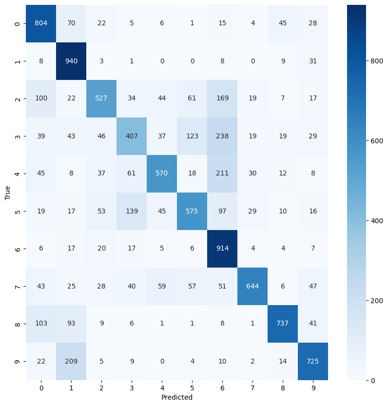
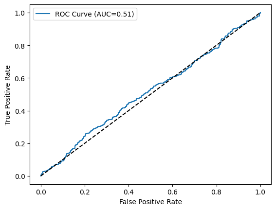
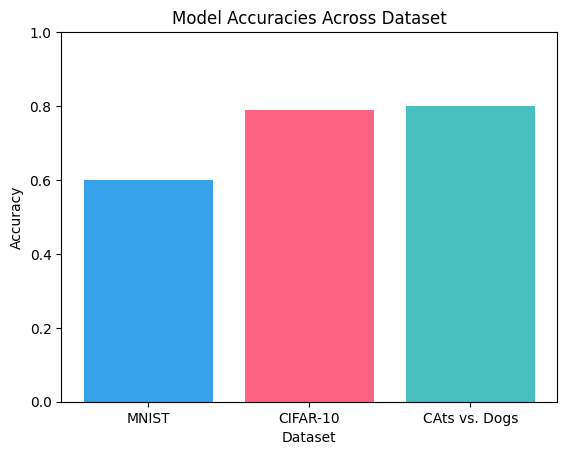

# Vision AI in 5 Days: From Beginner to Image Recognition Expert

🚀 **An end-to-end Image Recognition AI project** built in Python using Deep Learning (TensorFlow/Keras), trained to classify images with high accuracy.

---

## 📌 Overview
This project was developed during a 5-day bootcamp to guide participants from zero to building a complete **image recognition model** using Convolutional Neural Networks (CNNs) and Transfer Learning.

It covers:
- Image preprocessing & augmentation
- CNN model training & evaluation
- Transfer learning with MobileNetV2
- Visualization of metrics & predictions
- Documentation for a recruiter-ready portfolio

---

## 🛠 Tech Stack
- **Language:** Python
- **Libraries:** TensorFlow/Keras, OpenCV, NumPy, Matplotlib, scikit-learn
- **Tools:** Google Colab (GPU), GitHub
- **Dataset:** CIFAR-10 / Cats vs Dogs (Kaggle)

---

---

## 📊 Results

Here are some of the key outputs from my Image Recognition AI model:

**1️⃣ Training Accuracy & Loss**

**2️⃣ Confusion Matrix**

**3️⃣ Sample Predictions**

more:-

**1️⃣ Training Accuracy & Loss**

**2️⃣ Confusion Matrix**

---

## 🚀 How to Run
1. Open in Colab by clicking the badge above ☝  
2. Make sure GPU is enabled: **Runtime → Change runtime type → GPU**
3. Run all cells in `image_ai_bootcamp.ipynb`
4. Modify paths if using your own dataset

---

## 📽 Demo
*30-second video showing model predictions coming soon*

---

## 🙌 Acknowledgements
Special thanks to the bootcamp community for collaboration and feedback.

